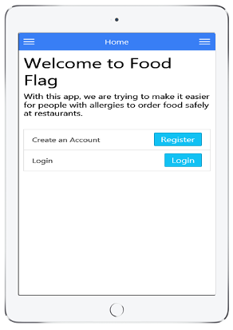

<h1>Food Flag Apps</h1>

   
    

      
      &nbsp;&nbsp;&nbsp;
      
    

   
  
  <h2>What Do These Apps Do</h2>
    <h4>
      

        This repository is a collection of three apps, a web-page app, an Android app, and an iPad/iPhone app,
        which helps people with food allergies decide what to eat when dining out at restaurants. All three
        apps share a common Firebase database; so registering and setting up an account on one app, will
        allow access to the same information on all three apps.
      

    </h4>
  
  <h2>What Features Do These Apps Have</h2>
    <h4>
      <ol>
        <li>Register an Account with E-Mail/Password</li>
        <li>Login using E-Mail/Password</li>
        <li>Login user social media (Facebook, Google, Twitter, Github)</li>
        <li>Change Password for your E-Mail/Password account</li>
        <li>Modify the menu system if logged in/logged out</li>
        <li>Allow the user to enter their allergy information (using standard report format)</li>
        <li>Display Allergens sorted alphabetically, or by category, and to select the display of
           only specific levels
        </li>
        <li>Allow the user to select a restuarant from a map, with restaurants ranked by the
           number of menu items without any allergens (How easy is it to find something to eat)
        </li>
        <li>View a Menu, with allergens highlighed, so the user can choose allergen free items,
           or know how to modify the foods to make them allergen free.
        </li>
        <li>Allow users to leave comments on menu items about allergens not listed in the
           menu descriptions, or about the flavor of a menu item after making modifications.
        </li>
      </ol>
    </h4>

  <h2>Getting The Apps</h2>
    <h4>
      

        This app is available four ways:
      

      <ol>
        <li>
          
          On the <a href="http://scottnakada.github.io/FoodFlag/yoFoodFlag/dist/public/index.html">web</a>:  
        </li>
        <li>
          
          On Android devices through the
          <a href="http://www.amazon.com/Quickstart-Prototypes-Food-Flag/dp/B014Q5BKGC/ref=sr_1_6?ie=UTF8&qid=1441077217&sr=8-6&keywords=quickstart+prototypes">
            Amazon Apps Store
          </a>.
        </li>
        <li>
          
          On Apple devices (iPhone/iPad), by downloading an app called Ionic View, and selecting the
          app id: <a href="#ios">f869122b</a>. See the next section for directions
          to try the app.  
        </li>
      </ol>
    </h4>
